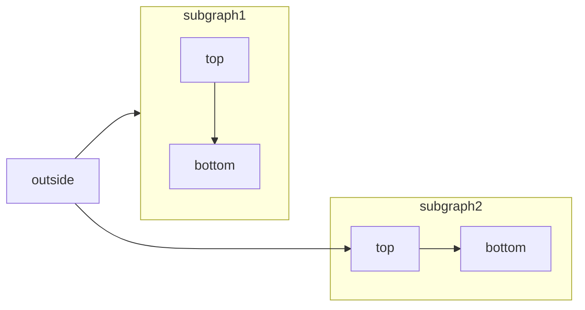
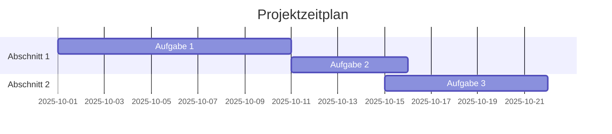
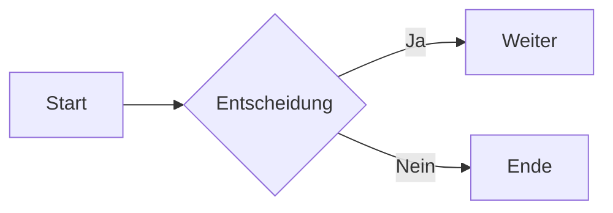
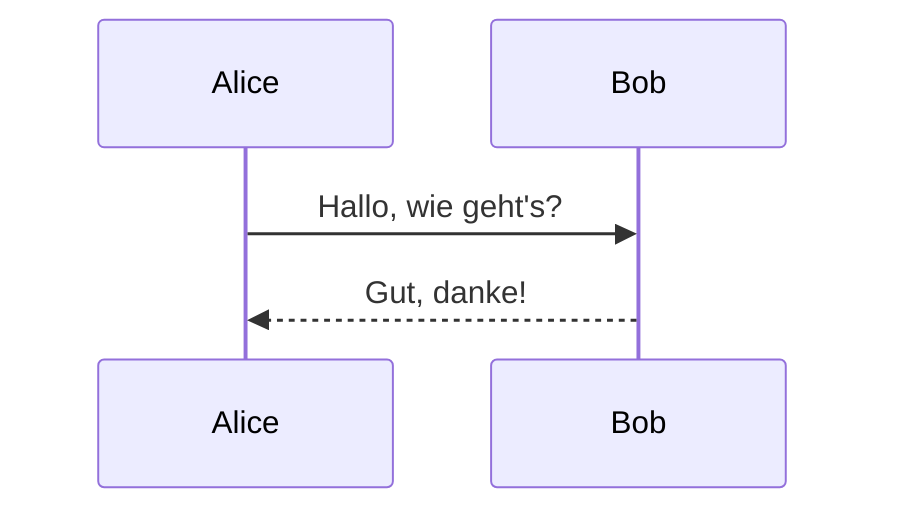
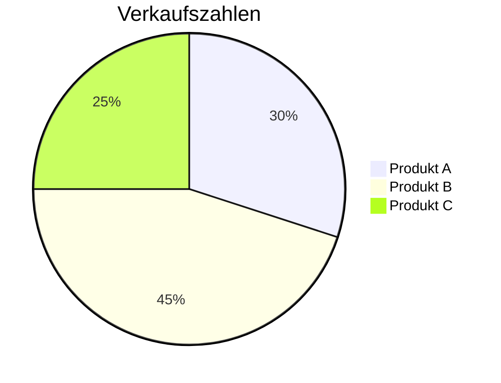
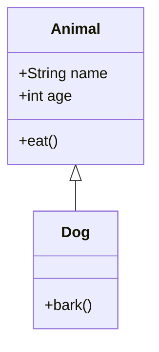

```mermaid
  flowchart LR
    subgraph subgraph1
        direction TB
        top1[top] --> bottom1[bottom]
    end
    subgraph subgraph2
        direction TB
        top2[top] --> bottom2[bottom]
    end
    %% ^ These subgraphs are identical, except for the links to them:

    %% Link *to* subgraph1: subgraph1 direction is maintained
    outside --> subgraph1
    %% Link *within* subgraph2:
    %% subgraph2 inherits the direction of the top-level graph (LR)
    outside ---> top2
```

```mermaid
gantt
  title Projektzeitplan
  dateFormat  YYYY-MM-DD
  section Abschnitt 1
  Aufgabe 1           :a1, 2025-10-01, 10d
  Aufgabe 2           :after a1  , 5d
  section Abschnitt 2
  Aufgabe 3           :2025-10-15  , 7d
```

```mermaid
flowchart LR
  A[Start] --> B{Entscheidung}
  B -->|Ja| C[Weiter]
  B -->|Nein| D[Ende]
```

```mermaid
sequenceDiagram
  Alice->>Bob: Hallo, wie geht's?
  Bob-->>Alice: Gut, danke!
```

```mermaid
pie
  title Verkaufszahlen
  "Produkt A" : 30
  "Produkt B" : 45
  "Produkt C" : 25
```

```mermaid
classDiagram
  class Animal {
    +String name
    +int age
    +eat()
  }
  class Dog {
    +bark()
  }
  Animal <|-- Dog
```

# 